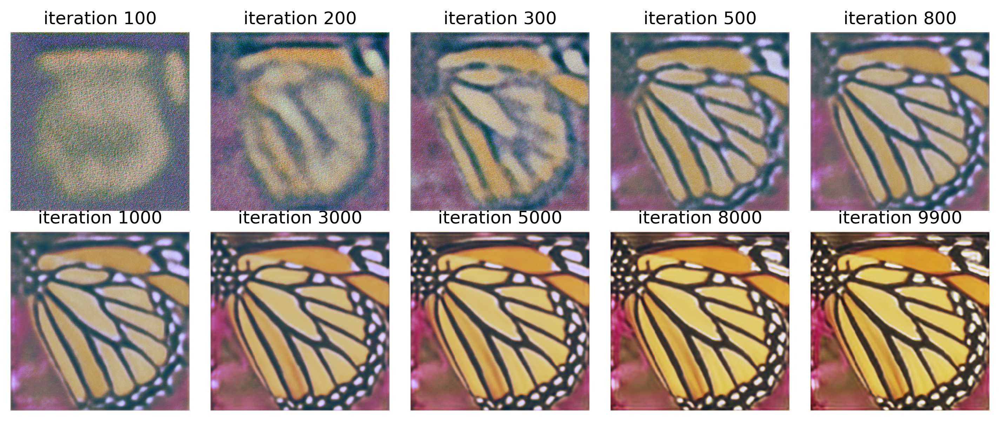

# Deep Image Prior

Single image super-resolution using the method from the paper [Deep Image Prior](https://dmitryulyanov.github.io/deep_image_prior).



## Usage

To run the script, execute

```bash
python3 -m --dataset ./path/to/dataset --logdir ./path/to/logdir 
```

## Important Notes

1. The model called UNet is not UNet but is inspired by it. The reason for the name is originally it was an implementation of
UNet but it was changed later on. This will be updated soon
2. The script expects the set5 dataset by default. Editing this will probably be necessary.